# AI Dungeon Tweaks – Userscript

A userscript (Tampermonkey/Violentmonkey) that improves how **AI Dungeon** text is displayed. It automatically converts AI Dungeon’s inline formatting (like `*italics*` or `**bold**`) into properly styled content and adds customisation features for story text.

➡️ [Skip to Installation](#installation-userscript)

Note: This project is unaffiliated with and not endorsed by AI Dungeon or Latitude.

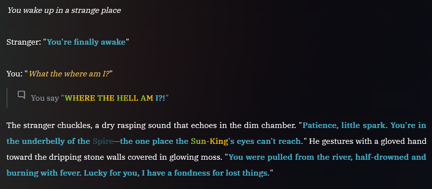

---

## ✨ Features

### 📝 Text Formatting
- Converts:
  - `*text*` / `_text_` → *italic*
  - `**text**` / `__text__` → **bold**
  - `~~text~~` → ~~strikethrough~~
  - `` `text` `` → `inline code`
  - `^^text^^` / `==text==` → ==highlight==
- Auto-closes unbalanced italics and quotation marks.
- Preserves valid HTML to avoid double formatting.

### 💬 Speech & Monologue

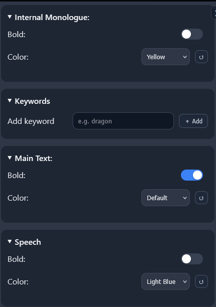
- **Speech:** `"text"` → styled speech.
  Configurable: bold, colour.
- **Monologue:** `*"text"*` → italicised speech.  
  Configurable: bold, colour.
- Remembers monologues per tab to prevent re-formatting.

### 🎬 Action Rows

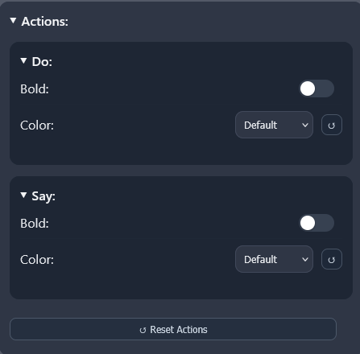
- Detects AI Dungeon action rows (Do & Say`).
- Configurable styles for:
  - Do
  - Main Text
  - Say

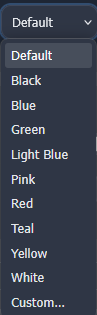

### 🎛️ Keyword & CAPS Effects

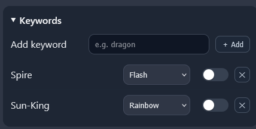
- Per-keyword styling with effects: `flash`, `strobe`, `rainbow`, `wave`, `breathe`, `static`.
- Optional per-keyword bold.
- Apply the same effects to ALL-CAPS words.

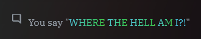

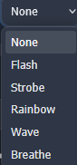

### 🔤 Typography

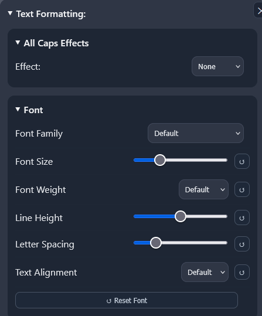
- Controls for Font, Font Size, Weight, Line Height, Letter Spacing, Alignment.
- Includes system fonts and Google Fonts.
- Normalises spacing across story rows.

### 🖼️ Backgrounds

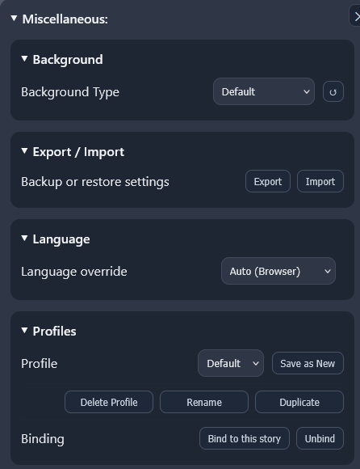
- Options: Default, Backdrop (behind overlays), Solid (override overlays). Planned: Gradient and custom image.
- Solid colour picker; opacity slider for Backdrop.

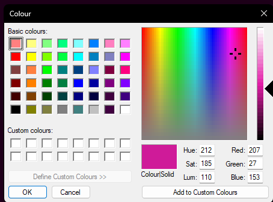

- Quick-apply recent colours and custom swatches.

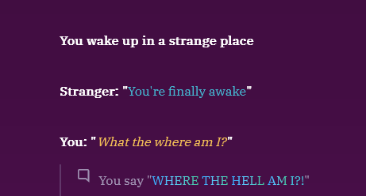

### ⚙️ Settings & Sync

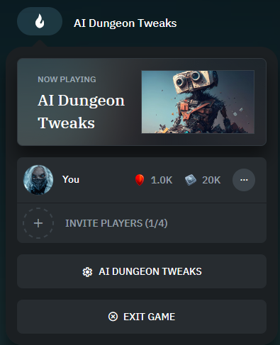
- In-page settings panel (AIDT ⚙️ button on the page).
- Section resets and global “Reset All”.
- Settings are saved to your browser’s local storage. Export/Import available from the panel.

### 🐞 Debug & Storage Hygiene

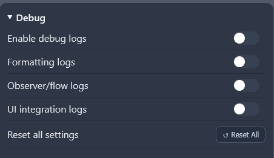
- Debug toggles: `debug`, `debugFormatting`, `debugObserver`, `debugUI`.

---

## 🛠 Installation (Userscript)

### One‑click install

If your browser shows the source code instead of an install prompt, install a userscript manager first (below), then click the button again.

### Get a userscript manager
- **Chrome / Edge / Brave**: Tampermonkey — [Chrome Web Store](https://chrome.google.com/webstore/detail/tampermonkey/dhdgffkkebhmkfjojejmpbldmpobfkfo)
- **Firefox**: Tampermonkey — [AMO](https://addons.mozilla.org/firefox/addon/tampermonkey/) or Violentmonkey — [AMO](https://addons.mozilla.org/firefox/addon/violentmonkey/)

### Steps
1. Install a userscript manager (Tampermonkey or Violentmonkey).
2. Click the **Install userscript** button above and approve the install in your manager.
3. Visit an AI Dungeon page. Ensure the script is enabled in your manager’s dashboard.
4. To update: new versions auto‑install via the script’s `@updateURL`. You can also open your manager and choose “Check for updates”.

---

## 🌐 Compatibility
- Supported managers: Tampermonkey (Chrome/Edge/Brave/Firefox), Violentmonkey (Firefox/Chromium).
- Not supported: Greasemonkey.

## 🔐 Scope & Permissions
- Match: `https://*.aidungeon.com/*`, `https://beta.aidungeon.com/*`, `https://play.aidungeon.com/*`
- Grants: none (`@grant none`)
- Auto‑update: handled via `@downloadURL` and `@updateURL` (bump `@version` when publishing changes).

## ⚡ Quick Start (manual install)
1. Copy the raw URL: `https://raw.githubusercontent.com/UnhealthyKraken/AIDungeonTweaks/main/ai-dungeon-tweaks.user.js`
2. Open your userscript manager → Create a new script.
3. Paste the contents; save.
4. Visit AI Dungeon and ensure the script is enabled.

## ✍️ Formatting rules at a glance
- Speech: "text"
- Internal monologue: *"text"*
- Bold: **text** or __text__
- Italic: *text* or _text_
- Strikethrough: ~~text~~
- Inline code: `text`
- Highlight: ^^text^^ or ==text==
- Colour: [color=red]text[/color]

## 💾 Settings & Data
- Settings are stored locally (keys prefixed with `aidt:`). Profiles and story bindings are supported.
- Export/Import available via the in‑page panel.

## 🔒 Privacy & Security
- Local‑only storage; no telemetry or analytics.
- No remote code; runs with `@grant none`.
- Network: only optional Google Fonts are fetched when you explicitly select a Google font.

## ⚠️ Known limitations
- Large or rapidly changing pages may delay formatting briefly; a refresh can help.
- Split quotes across multiple DOM nodes are handled, but rare edge cases may need a retry.
- Some site themes/overlays affect backgrounds; use Solid to override.

## 📱 Mobile
- Works in Android browsers that support userscript managers (Tampermonkey/Violentmonkey), e.g., Chromium‑based with extension support or Firefox variants that allow add‑ons.
- iOS support depends on a Safari userscript manager; not officially tested.

## 🚫 Known incompatibilities
- Greasemonkey (not supported).
- Other extensions/userscripts that modify AI Dungeon text can conflict with formatting or colours.
- Aggressive reader modes / overlay blockers may interfere with backgrounds and styling.

## 🧠 How It Works
- Targets AI Dungeon’s `transition-opacity` element.
- Uses `MutationObserver` to detect and reformat text changes.
- Converts formatting live while preserving site styling.
- Works across themes and dynamic content.

---

## 🌍 Localization
- Default: English (`en`).
- Included translations: `es`, `de`, `fr`, `pt_BR`, `ru`, `zh_CN`, `hi`, `ar`, `ja`, `ko`, `it`, `tr`, `id`.
- Contributions welcome: update the `LOCALES` map inside `ai-dungeon-tweaks.user.js` and open a PR.

Settings UI supports language override (default: auto-detect from browser).

---

## 📜 Changelog
See [`CHANGELOG.md`](CHANGELOG.md) for version history.

---

## 🤝 Support & Contributions
- Bugs/requests: open an Issue on GitHub.
- Translations: update the `LOCALES` map in `ai-dungeon-tweaks.user.js` and open a PR.
- Pull requests welcome.

## ❓ Troubleshooting
- Ensure you’re on an AI Dungeon page.
- Confirm a userscript manager (Tampermonkey/Violentmonkey) is installed and the script is enabled.
- Refresh the page.
- Check Browser Console (`Ctrl+Shift+J` or `F12`) for errors.

---

## 🔒 Security & CSP
- No remote script injection.
- If a site blocks external stylesheets, system fonts are used instead.

---

## 🗑 Uninstalling
1. Open your userscript manager (Tampermonkey/Violentmonkey) dashboard.
2. Find **AI Dungeon Tweaks**.
3. Disable or Remove.
